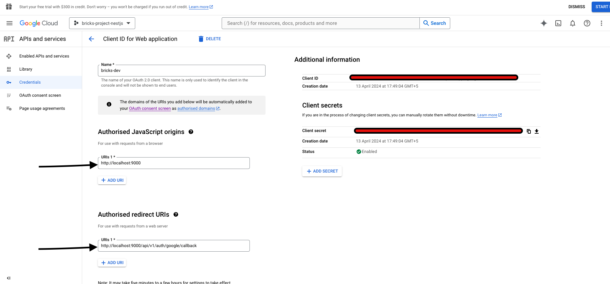
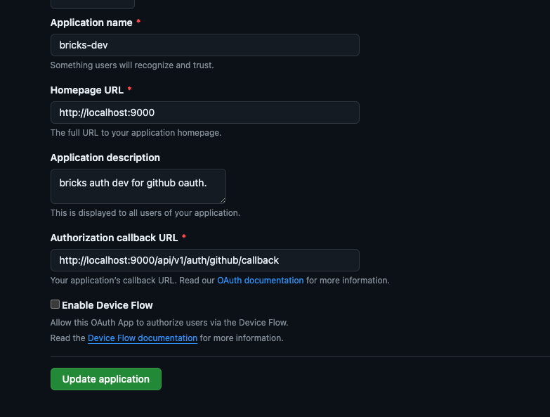

# Bricks

Bricks is a backend api for a real estate marketplace.

# Features

- User Authentication with Google and Github or Email and Password
- Three user roles : Super Admin, Admin, and User
- Super Admin can manage all the users and properties
- Admin can manage the properties (CRUD operations)
- User can view the properties and schedule meetings with the Admin to view the properties

# Running the application locally

- To run the application locally, you need to have Docker installed on your machine. Run the following command to start the docker container:

```sh
    docker compose up
```

- Copy the `.env.example` file to `.env` and update the environment variables accordingly.

- Reset the database schema and seed the database with the following command:

```sh
    npx prisma migrate reset
```

- Start the backend server with the following command:

```sh
    pnpm run start:dev
```

Server will start on `http://localhost:9000`

- You can import postman collection from the [docs/postman](docs/postman/) folder to test the API endpoints.

- View the API documentation at `http://localhost:9000/api/v1/docs`

# Integrating Google Auth

To generate the env variable likes `CLIENT_ID` and `CLIENT_SECRET`, you need to create a project in Google Cloud Platform and enable the Google Auth API.

Visit this [blog](https://thriveread.com/nestjs-oauth-serve-with-google-and-passport/?expand_article=1)
for reference.

The final outcome should look like this :



Notice : Redirect URL should be `http://localhost:9000/auth/google/callback`

where `http://localhost:9000` is the base URL of the Backend application.

If you host backend application on a different URL, you need to change the redirect URL accordingly. eg : `api.dev.com/auth/google/callback`

Here's is how the flow looks like:

- User clicks on the login button
- Call the `http://localhost:9000/api/v1/auth/google` endpoint
- This will redirect to the Google Auth page
- User enters the credentials
- Google will redirect to the `http://localhost:9000/auth/google/callback` with the code
- Backend will exchange the code with the Google Auth server and get the user details
- Backend will create a JWT token and send it back to the frontend in cookies
- Backend will redirec the user to `localhost:3000` with the JWT token in the cookies
- Frontend will store the in the cookies and use it for further requests

# Github Auth

- Head over to the [Github Developer Settings](https://github.com/settings/applications/new) and create a new OAuth App

the configuration should look like this:


Notice : Redirect URL should be `http://localhost:9000/auth/github/callback`

where `http://localhost:9000` is the base URL of the Backend application.

If you host backend application on a different URL, you need to change the redirect URL accordingly. eg : `api.dev.com/auth/github/callback`

Here's is how the flow looks like:

- User clicks on the login button
- Call the `http://localhost:9000/api/v1/auth/github` endpoint
- This will redirect to the Github Auth page
- User enters the credentials
- Github will redirect to the `http://localhost:9000/auth/github/callback` with the code
- Backend will exchange the code with the Github Auth server and get the user details
- Backend will create a JWT token and send it back to the frontend in cookies
- Backend will redirec the user to `localhost:3000` with the JWT token in the cookies
- Frontend will store the in the cookies and use it for further requests

# Commands

Database seeding happens in two ways with Prisma ORM: manually with `prisma db seed` and automatically in `prisma migrate dev` and prisma migrate reset.
